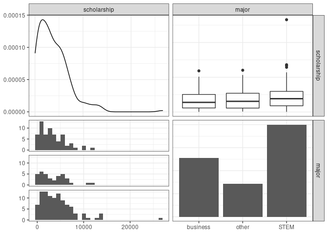
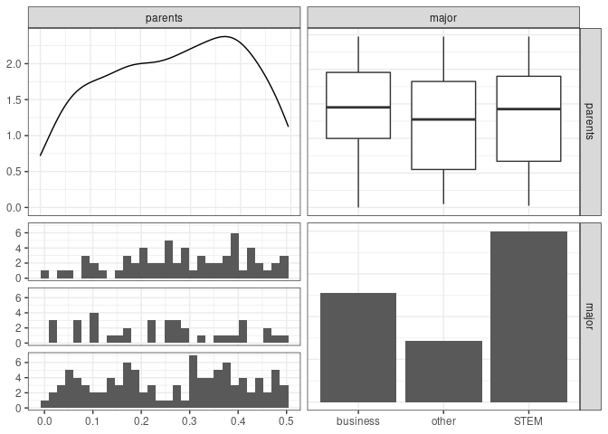

Activity 5 - Mini-competition Explorations
================

### Libraries

``` r
library(tidyverse)
```

    ## ── Attaching packages ─────────────────────────────────────── tidyverse 1.3.2 ──
    ## ✔ ggplot2 3.3.6     ✔ purrr   0.3.4
    ## ✔ tibble  3.1.8     ✔ dplyr   1.0.9
    ## ✔ tidyr   1.2.0     ✔ stringr 1.4.1
    ## ✔ readr   2.1.2     ✔ forcats 0.5.2
    ## ── Conflicts ────────────────────────────────────────── tidyverse_conflicts() ──
    ## ✖ dplyr::filter() masks stats::filter()
    ## ✖ dplyr::lag()    masks stats::lag()

``` r
library(tidymodels)
```

    ## ── Attaching packages ────────────────────────────────────── tidymodels 1.0.0 ──
    ## ✔ broom        1.0.0     ✔ rsample      1.1.0
    ## ✔ dials        1.0.0     ✔ tune         1.0.0
    ## ✔ infer        1.0.3     ✔ workflows    1.0.0
    ## ✔ modeldata    1.0.0     ✔ workflowsets 1.0.0
    ## ✔ parsnip      1.0.1     ✔ yardstick    1.0.0
    ## ✔ recipes      1.0.1     
    ## ── Conflicts ───────────────────────────────────────── tidymodels_conflicts() ──
    ## ✖ scales::discard() masks purrr::discard()
    ## ✖ dplyr::filter()   masks stats::filter()
    ## ✖ recipes::fixed()  masks stringr::fixed()
    ## ✖ dplyr::lag()      masks stats::lag()
    ## ✖ yardstick::spec() masks readr::spec()
    ## ✖ recipes::step()   masks stats::step()
    ## • Use tidymodels_prefer() to resolve common conflicts.

``` r
library(GGally)
```

    ## Registered S3 method overwritten by 'GGally':
    ##   method from   
    ##   +.gg   ggplot2

### Get Data

``` r
students <- read_csv("data/allendale-students.csv")
```

    ## Rows: 200 Columns: 7
    ## ── Column specification ────────────────────────────────────────────────────────
    ## Delimiter: ","
    ## chr (2): housing, major
    ## dbl (5): distance, scholarship, parents, car, debt
    ## 
    ## ℹ Use `spec()` to retrieve the full column specification for this data.
    ## ℹ Specify the column types or set `show_col_types = FALSE` to quiet this message.

``` r
students %>% 
  ggplot(aes(x=debt)) + 
  geom_histogram(bins = 24) + 
  theme_bw()
```

<!-- -->

``` r
model <- lm(debt ~ distance, data = students)
tidy(model)
```

    ## # A tibble: 2 × 5
    ##   term        estimate std.error statistic  p.value
    ##   <chr>          <dbl>     <dbl>     <dbl>    <dbl>
    ## 1 (Intercept)  24911.     768.       32.4  4.07e-81
    ## 2 distance        47.3      5.85      8.08 6.16e-14

``` r
summary(model)
```

    ## 
    ## Call:
    ## lm(formula = debt ~ distance, data = students)
    ## 
    ## Residuals:
    ##      Min       1Q   Median       3Q      Max 
    ## -24309.2  -4462.7    807.5   5287.1  17941.3 
    ## 
    ## Coefficients:
    ##              Estimate Std. Error t value Pr(>|t|)    
    ## (Intercept) 24910.734    768.493  32.415  < 2e-16 ***
    ## distance       47.250      5.846   8.083 6.16e-14 ***
    ## ---
    ## Signif. codes:  0 '***' 0.001 '**' 0.01 '*' 0.05 '.' 0.1 ' ' 1
    ## 
    ## Residual standard error: 7376 on 198 degrees of freedom
    ## Multiple R-squared:  0.2481, Adjusted R-squared:  0.2443 
    ## F-statistic: 65.33 on 1 and 198 DF,  p-value: 6.155e-14

``` r
model <- lm(debt ~ scholarship, data = students)
tidy(model)
```

    ## # A tibble: 2 × 5
    ##   term        estimate std.error statistic   p.value
    ##   <chr>          <dbl>     <dbl>     <dbl>     <dbl>
    ## 1 (Intercept) 35736.     702.         50.9 1.19e-115
    ## 2 scholarship    -1.61     0.136     -11.8 1.02e- 24

``` r
summary(model)
```

    ## 
    ## Call:
    ## lm(formula = debt ~ scholarship, data = students)
    ## 
    ## Residuals:
    ##      Min       1Q   Median       3Q      Max 
    ## -16411.4  -4396.4     48.9   3414.1  20885.9 
    ## 
    ## Coefficients:
    ##              Estimate Std. Error t value Pr(>|t|)    
    ## (Intercept) 35735.773    702.378   50.88   <2e-16 ***
    ## scholarship    -1.606      0.136  -11.81   <2e-16 ***
    ## ---
    ## Signif. codes:  0 '***' 0.001 '**' 0.01 '*' 0.05 '.' 0.1 ' ' 1
    ## 
    ## Residual standard error: 6515 on 198 degrees of freedom
    ## Multiple R-squared:  0.4134, Adjusted R-squared:  0.4104 
    ## F-statistic: 139.5 on 1 and 198 DF,  p-value: < 2.2e-16

``` r
model <- lm(debt ~ parents, data = students)
tidy(model)
```

    ## # A tibble: 2 × 5
    ##   term        estimate std.error statistic  p.value
    ##   <chr>          <dbl>     <dbl>     <dbl>    <dbl>
    ## 1 (Intercept)   35587.     1209.     29.4  3.03e-74
    ## 2 parents      -22932.     4023.     -5.70 4.30e- 8

``` r
summary(model)
```

    ## 
    ## Call:
    ## lm(formula = debt ~ parents, data = students)
    ## 
    ## Residuals:
    ##      Min       1Q   Median       3Q      Max 
    ## -24739.8  -4258.1    518.4   5276.4  19231.6 
    ## 
    ## Coefficients:
    ##             Estimate Std. Error t value Pr(>|t|)    
    ## (Intercept)    35587       1209   29.44  < 2e-16 ***
    ## parents       -22932       4023   -5.70  4.3e-08 ***
    ## ---
    ## Signif. codes:  0 '***' 0.001 '**' 0.01 '*' 0.05 '.' 0.1 ' ' 1
    ## 
    ## Residual standard error: 7884 on 198 degrees of freedom
    ## Multiple R-squared:  0.141,  Adjusted R-squared:  0.1366 
    ## F-statistic: 32.49 on 1 and 198 DF,  p-value: 4.303e-08

``` r
model <- lm(debt ~ car, data = students)
tidy(model)
```

    ## # A tibble: 2 × 5
    ##   term        estimate std.error statistic  p.value
    ##   <chr>          <dbl>     <dbl>     <dbl>    <dbl>
    ## 1 (Intercept)  29554.      2192.   13.5    7.91e-30
    ## 2 car            -11.4      298.   -0.0384 9.69e- 1

``` r
summary(model)
```

    ## 
    ## Call:
    ## lm(formula = debt ~ car, data = students)
    ## 
    ## Residuals:
    ##      Min       1Q   Median       3Q      Max 
    ## -27489.0  -5245.2    353.4   5556.9  19756.7 
    ## 
    ## Coefficients:
    ##             Estimate Std. Error t value Pr(>|t|)    
    ## (Intercept) 29553.71    2191.52  13.485   <2e-16 ***
    ## car           -11.44     297.65  -0.038    0.969    
    ## ---
    ## Signif. codes:  0 '***' 0.001 '**' 0.01 '*' 0.05 '.' 0.1 ' ' 1
    ## 
    ## Residual standard error: 8506 on 198 degrees of freedom
    ## Multiple R-squared:  7.458e-06,  Adjusted R-squared:  -0.005043 
    ## F-statistic: 0.001477 on 1 and 198 DF,  p-value: 0.9694

``` r
model <- lm(debt ~ housing, data = students)
tidy(model)
```

    ## # A tibble: 2 × 5
    ##   term             estimate std.error statistic  p.value
    ##   <chr>               <dbl>     <dbl>     <dbl>    <dbl>
    ## 1 (Intercept)        28790.      773.     37.3  2.08e-91
    ## 2 housingon campus    1708.     1222.      1.40 1.64e- 1

``` r
summary(model)
```

    ## 
    ## Call:
    ## lm(formula = debt ~ housing, data = students)
    ## 
    ## Residuals:
    ##    Min     1Q Median     3Q    Max 
    ## -26771  -4689    485   5577  18907 
    ## 
    ## Coefficients:
    ##                  Estimate Std. Error t value Pr(>|t|)    
    ## (Intercept)       28789.6      772.7  37.258   <2e-16 ***
    ## housingon campus   1707.8     1221.8   1.398    0.164    
    ## ---
    ## Signif. codes:  0 '***' 0.001 '**' 0.01 '*' 0.05 '.' 0.1 ' ' 1
    ## 
    ## Residual standard error: 8465 on 198 degrees of freedom
    ## Multiple R-squared:  0.009771,   Adjusted R-squared:  0.00477 
    ## F-statistic: 1.954 on 1 and 198 DF,  p-value: 0.1637

``` r
model <- lm(debt ~ major, data = students)
tidy(model)
```

    ## # A tibble: 3 × 5
    ##   term        estimate std.error statistic  p.value
    ##   <chr>          <dbl>     <dbl>     <dbl>    <dbl>
    ## 1 (Intercept)   30746.     1059.    29.0   4.51e-73
    ## 2 majorother    -1159.     1766.    -0.656 5.12e- 1
    ## 3 majorSTEM     -2129.     1357.    -1.57  1.18e- 1

``` r
summary(model)
```

    ## 
    ## Call:
    ## lm(formula = debt ~ major, data = students)
    ## 
    ## Residuals:
    ##      Min       1Q   Median       3Q      Max 
    ## -26597.8  -5385.3    383.2   5315.9  20579.2 
    ## 
    ## Coefficients:
    ##             Estimate Std. Error t value Pr(>|t|)    
    ## (Intercept)    30746       1059  29.023   <2e-16 ***
    ## majorother     -1159       1766  -0.656    0.512    
    ## majorSTEM      -2129       1357  -1.569    0.118    
    ## ---
    ## Signif. codes:  0 '***' 0.001 '**' 0.01 '*' 0.05 '.' 0.1 ' ' 1
    ## 
    ## Residual standard error: 8475 on 197 degrees of freedom
    ## Multiple R-squared:  0.01239,    Adjusted R-squared:  0.00236 
    ## F-statistic: 1.235 on 2 and 197 DF,  p-value: 0.293

``` r
mlr_models <- lm(debt ~ distance + scholarship + parents , data = students)
summary(mlr_models)
```

    ## 
    ## Call:
    ## lm(formula = debt ~ distance + scholarship + parents, data = students)
    ## 
    ## Residuals:
    ##      Min       1Q   Median       3Q      Max 
    ## -11284.8  -2774.3    263.9   2575.6  24069.8 
    ## 
    ## Coefficients:
    ##               Estimate Std. Error t value Pr(>|t|)    
    ## (Intercept)  3.751e+04  8.522e+02   44.02   <2e-16 ***
    ## distance     4.048e+01  3.429e+00   11.81   <2e-16 ***
    ## scholarship -1.544e+00  9.014e-02  -17.13   <2e-16 ***
    ## parents     -2.222e+04  2.201e+03  -10.09   <2e-16 ***
    ## ---
    ## Signif. codes:  0 '***' 0.001 '**' 0.01 '*' 0.05 '.' 0.1 ' ' 1
    ## 
    ## Residual standard error: 4304 on 196 degrees of freedom
    ## Multiple R-squared:  0.7466, Adjusted R-squared:  0.7427 
    ## F-statistic: 192.5 on 3 and 196 DF,  p-value: < 2.2e-16

``` r
mlr_models <- lm(debt ~ distance * car + scholarship + parents, data = students)
summary(mlr_models)
```

    ## 
    ## Call:
    ## lm(formula = debt ~ distance * car + scholarship + parents, data = students)
    ## 
    ## Residuals:
    ##      Min       1Q   Median       3Q      Max 
    ## -11238.6  -2841.0    179.8   2713.4  24253.7 
    ## 
    ## Coefficients:
    ##                Estimate Std. Error t value Pr(>|t|)    
    ## (Intercept)   3.843e+04  1.815e+03  21.178   <2e-16 ***
    ## distance      2.929e+01  1.306e+01   2.242   0.0261 *  
    ## car          -1.294e+02  2.252e+02  -0.575   0.5663    
    ## scholarship  -1.550e+00  9.066e-02 -17.098   <2e-16 ***
    ## parents      -2.217e+04  2.209e+03 -10.034   <2e-16 ***
    ## distance:car  1.580e+00  1.779e+00   0.888   0.3756    
    ## ---
    ## Signif. codes:  0 '***' 0.001 '**' 0.01 '*' 0.05 '.' 0.1 ' ' 1
    ## 
    ## Residual standard error: 4317 on 194 degrees of freedom
    ## Multiple R-squared:  0.7477, Adjusted R-squared:  0.7412 
    ## F-statistic:   115 on 5 and 194 DF,  p-value: < 2.2e-16

``` r
mlr_models <- lm(debt ~ distance * scholarship * parents , data = students)
summary(mlr_models)
```

    ## 
    ## Call:
    ## lm(formula = debt ~ distance * scholarship * parents, data = students)
    ## 
    ## Residuals:
    ##     Min      1Q  Median      3Q     Max 
    ## -9436.7 -2365.9   179.4  2584.2 19789.5 
    ## 
    ## Coefficients:
    ##                                Estimate Std. Error t value Pr(>|t|)    
    ## (Intercept)                   4.010e+04  1.773e+03  22.615  < 2e-16 ***
    ## distance                      2.992e+01  1.537e+01   1.947    0.053 .  
    ## scholarship                  -1.739e+00  3.635e-01  -4.784 3.42e-06 ***
    ## parents                      -3.388e+04  5.599e+03  -6.051 7.42e-09 ***
    ## distance:scholarship         -1.936e-03  3.495e-03  -0.554    0.580    
    ## distance:parents              6.937e+01  5.266e+01   1.317    0.189    
    ## scholarship:parents           1.342e+00  1.095e+00   1.226    0.222    
    ## distance:scholarship:parents -1.455e-03  1.157e-02  -0.126    0.900    
    ## ---
    ## Signif. codes:  0 '***' 0.001 '**' 0.01 '*' 0.05 '.' 0.1 ' ' 1
    ## 
    ## Residual standard error: 4207 on 192 degrees of freedom
    ## Multiple R-squared:  0.7628, Adjusted R-squared:  0.7542 
    ## F-statistic: 88.21 on 7 and 192 DF,  p-value: < 2.2e-16

``` r
mlr_models <- lm(debt ~ distance * scholarship * parents * housing, data = students)
summary(mlr_models)
```

    ## 
    ## Call:
    ## lm(formula = debt ~ distance * scholarship * parents * housing, 
    ##     data = students)
    ## 
    ## Residuals:
    ##      Min       1Q   Median       3Q      Max 
    ## -10221.0  -2548.4    261.1   2512.4  17341.7 
    ## 
    ## Coefficients:
    ##                                                 Estimate Std. Error t value
    ## (Intercept)                                    3.780e+04  2.462e+03  15.357
    ## distance                                       4.068e+01  2.198e+01   1.851
    ## scholarship                                   -1.466e+00  5.614e-01  -2.611
    ## parents                                       -2.930e+04  7.442e+03  -3.937
    ## housingon campus                               4.793e+03  3.657e+03   1.310
    ## distance:scholarship                          -3.544e-03  5.504e-03  -0.644
    ## distance:parents                               4.267e+01  7.693e+01   0.555
    ## scholarship:parents                            8.705e-01  1.594e+00   0.546
    ## distance:housingon campus                     -1.868e+01  3.126e+01  -0.598
    ## scholarship:housingon campus                  -4.883e-01  7.502e-01  -0.651
    ## parents:housingon campus                      -5.607e+03  1.219e+04  -0.460
    ## distance:scholarship:parents                   3.889e-03  1.741e-02   0.223
    ## distance:scholarship:housingon campus          2.637e-03  7.274e-03   0.363
    ## distance:parents:housingon campus              2.577e+01  1.100e+02   0.234
    ## scholarship:parents:housingon campus          -2.602e-01  2.395e+00  -0.109
    ## distance:scholarship:parents:housingon campus -4.193e-03  2.443e-02  -0.172
    ##                                               Pr(>|t|)    
    ## (Intercept)                                    < 2e-16 ***
    ## distance                                      0.065835 .  
    ## scholarship                                   0.009773 ** 
    ## parents                                       0.000117 ***
    ## housingon campus                              0.191675    
    ## distance:scholarship                          0.520439    
    ## distance:parents                              0.579792    
    ## scholarship:parents                           0.585710    
    ## distance:housingon campus                     0.550847    
    ## scholarship:housingon campus                  0.515983    
    ## parents:housingon campus                      0.646069    
    ## distance:scholarship:parents                  0.823486    
    ## distance:scholarship:housingon campus         0.717389    
    ## distance:parents:housingon campus             0.815042    
    ## scholarship:parents:housingon campus          0.913596    
    ## distance:scholarship:parents:housingon campus 0.863906    
    ## ---
    ## Signif. codes:  0 '***' 0.001 '**' 0.01 '*' 0.05 '.' 0.1 ' ' 1
    ## 
    ## Residual standard error: 4210 on 184 degrees of freedom
    ## Multiple R-squared:  0.7724, Adjusted R-squared:  0.7538 
    ## F-statistic: 41.62 on 15 and 184 DF,  p-value: < 2.2e-16

``` r
mlr_models <- lm(debt ~ distance * scholarship * parents * major, data = students)
summary(mlr_models)
```

    ## 
    ## Call:
    ## lm(formula = debt ~ distance * scholarship * parents * major, 
    ##     data = students)
    ## 
    ## Residuals:
    ##      Min       1Q   Median       3Q      Max 
    ## -10640.4  -2302.9    241.2   2018.0  15865.7 
    ## 
    ## Coefficients:
    ##                                           Estimate Std. Error t value Pr(>|t|)
    ## (Intercept)                              4.116e+04  3.803e+03  10.824  < 2e-16
    ## distance                                 1.230e+01  3.396e+01   0.362  0.71765
    ## scholarship                             -1.338e+00  7.611e-01  -1.758  0.08057
    ## parents                                 -2.930e+04  1.101e+04  -2.661  0.00851
    ## majorother                               3.153e+03  4.840e+03   0.652  0.51552
    ## majorSTEM                               -5.564e+03  4.616e+03  -1.205  0.22964
    ## distance:scholarship                    -3.108e-04  6.801e-03  -0.046  0.96360
    ## distance:parents                         1.083e+02  1.034e+02   1.047  0.29656
    ## scholarship:parents                     -9.779e-01  2.112e+00  -0.463  0.64399
    ## distance:majorother                     -9.082e+00  4.527e+01  -0.201  0.84123
    ## distance:majorSTEM                       5.504e+01  4.081e+01   1.349  0.17913
    ## scholarship:majorother                  -1.364e+00  1.120e+00  -1.219  0.22466
    ## scholarship:majorSTEM                    1.286e-01  9.120e-01   0.141  0.88800
    ## parents:majorother                      -1.493e+04  1.566e+04  -0.953  0.34167
    ## parents:majorSTEM                        3.305e+03  1.378e+04   0.240  0.81078
    ## distance:scholarship:parents            -1.006e-02  2.096e-02  -0.480  0.63188
    ## distance:scholarship:majorother          5.913e-03  1.183e-02   0.500  0.61786
    ## distance:scholarship:majorSTEM          -7.213e-03  8.297e-03  -0.869  0.38581
    ## distance:parents:majorother             -2.781e+01  1.554e+02  -0.179  0.85820
    ## distance:parents:majorSTEM              -1.128e+02  1.310e+02  -0.861  0.39051
    ## scholarship:parents:majorother           4.982e+00  3.531e+00   1.411  0.15999
    ## scholarship:parents:majorSTEM            1.426e+00  2.610e+00   0.546  0.58546
    ## distance:scholarship:parents:majorother -1.283e-02  3.822e-02  -0.336  0.73749
    ## distance:scholarship:parents:majorSTEM   2.323e-02  2.665e-02   0.872  0.38451
    ##                                            
    ## (Intercept)                             ***
    ## distance                                   
    ## scholarship                             .  
    ## parents                                 ** 
    ## majorother                                 
    ## majorSTEM                                  
    ## distance:scholarship                       
    ## distance:parents                           
    ## scholarship:parents                        
    ## distance:majorother                        
    ## distance:majorSTEM                         
    ## scholarship:majorother                     
    ## scholarship:majorSTEM                      
    ## parents:majorother                         
    ## parents:majorSTEM                          
    ## distance:scholarship:parents               
    ## distance:scholarship:majorother            
    ## distance:scholarship:majorSTEM             
    ## distance:parents:majorother                
    ## distance:parents:majorSTEM                 
    ## scholarship:parents:majorother             
    ## scholarship:parents:majorSTEM              
    ## distance:scholarship:parents:majorother    
    ## distance:scholarship:parents:majorSTEM     
    ## ---
    ## Signif. codes:  0 '***' 0.001 '**' 0.01 '*' 0.05 '.' 0.1 ' ' 1
    ## 
    ## Residual standard error: 4025 on 176 degrees of freedom
    ## Multiple R-squared:  0.8009, Adjusted R-squared:  0.7749 
    ## F-statistic: 30.79 on 23 and 176 DF,  p-value: < 2.2e-16

``` r
mlr_models <- lm(debt ~ scholarship * parents * major, data = students)
summary(mlr_models)
```

    ## 
    ## Call:
    ## lm(formula = debt ~ scholarship * parents * major, data = students)
    ## 
    ## Residuals:
    ##      Min       1Q   Median       3Q      Max 
    ## -12745.5  -3450.9   -999.5   3395.0  20168.5 
    ## 
    ## Coefficients:
    ##                                  Estimate Std. Error t value Pr(>|t|)    
    ## (Intercept)                     4.327e+04  2.922e+03  14.808   <2e-16 ***
    ## scholarship                    -1.510e+00  6.047e-01  -2.497   0.0134 *  
    ## parents                        -2.102e+04  8.946e+03  -2.350   0.0198 *  
    ## majorother                      2.826e+03  4.242e+03   0.666   0.5061    
    ## majorSTEM                      -2.461e+00  3.426e+03  -0.001   0.9994    
    ## scholarship:parents            -1.609e+00  1.842e+00  -0.873   0.3835    
    ## scholarship:majorother         -8.460e-01  8.228e-01  -1.028   0.3052    
    ## scholarship:majorSTEM          -5.541e-01  6.842e-01  -0.810   0.4191    
    ## parents:majorother             -2.022e+04  1.422e+04  -1.422   0.1568    
    ## parents:majorSTEM              -9.681e+03  1.075e+04  -0.900   0.3691    
    ## scholarship:parents:majorother  3.999e+00  2.869e+00   1.394   0.1651    
    ## scholarship:parents:majorSTEM   3.699e+00  2.107e+00   1.756   0.0808 .  
    ## ---
    ## Signif. codes:  0 '***' 0.001 '**' 0.01 '*' 0.05 '.' 0.1 ' ' 1
    ## 
    ## Residual standard error: 5545 on 188 degrees of freedom
    ## Multiple R-squared:  0.5965, Adjusted R-squared:  0.5729 
    ## F-statistic: 25.26 on 11 and 188 DF,  p-value: < 2.2e-16

``` r
students %>% 
  select(scholarship, major) %>%  
  ggpairs() + 
  theme_bw()
```

    ## `stat_bin()` using `bins = 30`. Pick better value with `binwidth`.

<!-- -->

``` r
students %>% 
  select(parents, major) %>%  
  ggpairs() + 
  theme_bw()
```

    ## `stat_bin()` using `bins = 30`. Pick better value with `binwidth`.

<!-- -->

``` r
# add natural log transformation to existing dataset
students <- students %>%
  mutate(log_scholarship =  log(scholarship))
```

``` r
model <- lm(debt ~ log_scholarship, data = students)
summary(model)
```

    ## 
    ## Call:
    ## lm(formula = debt ~ log_scholarship, data = students)
    ## 
    ## Residuals:
    ##      Min       1Q   Median       3Q      Max 
    ## -20705.5  -4260.0    474.8   4124.2  20337.1 
    ## 
    ## Coefficients:
    ##                 Estimate Std. Error t value Pr(>|t|)    
    ## (Intercept)      60353.0     3396.4  17.770   <2e-16 ***
    ## log_scholarship  -3959.0      430.6  -9.194   <2e-16 ***
    ## ---
    ## Signif. codes:  0 '***' 0.001 '**' 0.01 '*' 0.05 '.' 0.1 ' ' 1
    ## 
    ## Residual standard error: 7121 on 198 degrees of freedom
    ## Multiple R-squared:  0.2992, Adjusted R-squared:  0.2956 
    ## F-statistic: 84.52 on 1 and 198 DF,  p-value: < 2.2e-16
